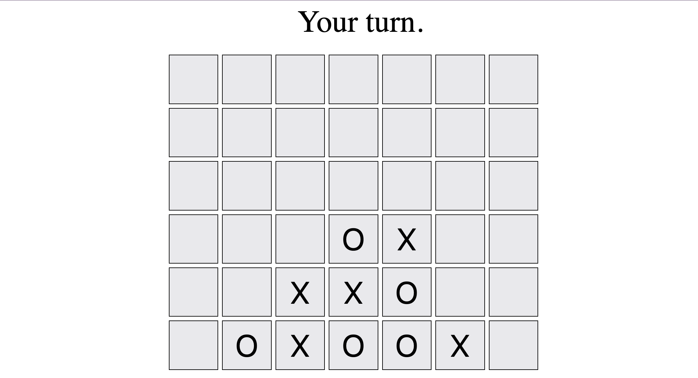

<!---Update the image !! --->

<p align="center">

</p>

<h2 align="center"><i>Socket-Backed Multiplayer Connect Four</i></h2>


## Intro

This website is currently hosted at [this link](https://ancient-chelsae-jules-personal-c110e413.koyeb.app/)!

It is a work in progress as of July 2024, and as of now supports connect four multiplayer matchplay.

## Installation

### Server

To run the server locally, clone the repo and navigate into the server directory.
Within the server directory, install the required modules then build the project.

```
npm install
npm run build
```

And then to run locally:

```
npm run start
```

### Client

To connect as a client, visit localhost at port 8081, which can be found at this [link](http://localhost:8081/).

## Usage 

At the website, simply visit it and wait for the next person to join!
You will play the person who joins immediately before or after you.

Make sure you are joining on the same server as the other client. So you may not have one connect via localhost and the other on the Koyeb url.

## Credits

This project was made possible by [Koyeb](app.koyeb.com) and is based on this [tic-tac-toe tutorial]([url](https://antoniomignano.medium.com/node-js-socket-io-express-tic-tac-toe-10cff9108f7)) written by Antonio Mignano.

